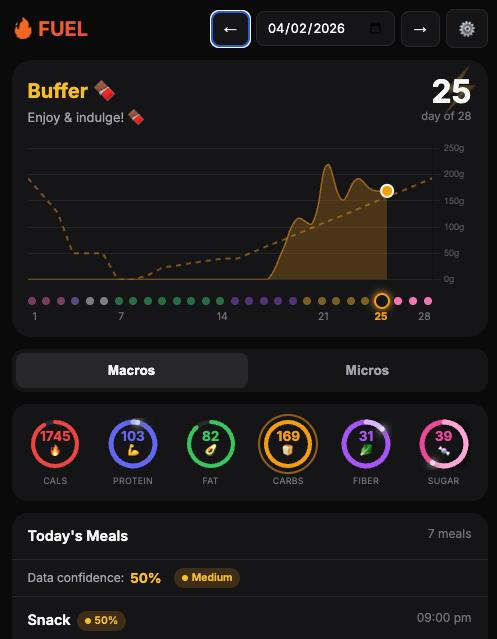

# FUEL

**Food is fuel.** It's how your body gets energy — and it's one of the hardest things for humans to manage well.

We tie food to emotions, to comfort, to celebration, to stress. That's natural. But it makes it hard to eat *optimally* — to consistently give your body what it actually needs. Tracking macros, hitting protein targets, watching micronutrients — most people try for a week and quit.

That's why FUEL is built for AI agents. Your agent doesn't have an emotional relationship with food. It can learn your habits, figure out what you like, track what you eat, and quietly make sure you're properly fueled — without judgment, without burnout. You eat what you want. Your agent handles the rest.

FUEL gives agents the tools to do this well: a full nutrition database, personalized daily targets (flat or cycling), USDA micronutrient enrichment, and a dashboard to see it all at a glance. The interface is fully agent-managed, but everything is customizable — a robust database architecture with 50+ nutrition fields gives your agent solid ground truth to work from, and the single-file dashboard is easy to adapt to your needs.

## What Makes FUEL Different

**Most trackers give you one number.** Eat 2,000 calories. Every day. Forever.

FUEL gives you a different number every day, calculated from where you are in your cycle:

```
Day 1  ████████████████████  2,200 cal  <- Buffer (feast)
Day 6  ██████████████        1,700 cal  <- Pre-fast
Day 7  ░░░░░░░░░░░░░░░░░░░░      0 cal  <- Fasting
Day 9  ████████              1,000 cal  <- Keto (rebuilding)
Day 14 ████████████          1,500 cal  <- Keto -> Normal
Day 20 ██████████████████    1,900 cal  <- Refuel
Day 28 ████████████████████  2,200 cal  <- Buffer (feast)
```

Every macro shifts too — protein, carbs, fat, fiber, sugar — each on its own curve. No two days are exactly the same.

**Don't want cycling?** Turn it off. FUEL works as a straightforward tracker with balanced daily targets based on your TDEE.

## Screenshots

<p align="center">
  
</p>

*Dashboard showing macro tracking rings, cycle phase timeline, and daily meal log.*

## Features

- **Smart Daily Targets** — Flat TDEE or dynamic 6-phase cycling (Buffer -> Pre-Fast -> Fasting -> Keto -> Reintro -> Refuel)
- **50+ Nutrition Fields** — Macros, vitamins, minerals, amino acids, omega-3/6
- **USDA Auto-Enrichment** — Missing micronutrients filled automatically from USDA FoodData Central
- **Beautiful Dashboard** — Dark theme, animated macro rings, phase timeline, meal history
- **Agent-First Design** — Full REST API + SKILL.md for AI agent integration
- **Extensible Modes** — Cycling is just the first mode. Architecture supports wearables, CGM, workout sync
- **Secret URL Token** — Dashboard hidden behind a token prefix. No token = 404.
- **SQLite** — Single file database. No server setup. Portable.

## Quick Start

### Prerequisites

- **Node.js** 18+ (with npm)
- **Python 3** (optional, for seeding the food database)

### Install

```bash
git clone https://github.com/user/fuel.git
cd fuel

# Configure environment
cp .env.example .env
# Edit .env:
#   ACCESS_TOKEN  — set to a random string (see below)
#   USDA_API_KEY  — optional, for micronutrient auto-enrichment
#                   (free: https://fdc.nal.usda.gov/api-key-signup.html)
#   USER_TIMEZONE — your IANA timezone (e.g., America/New_York)

# Install dependencies
npm install

# Start the server
npm start
```

The server starts at `http://localhost:3456`. The database and schema are created automatically on first run.

### Seed Common Foods (Optional)

```bash
python3 seed_foods.py
# Adds 33 common foods (eggs, chicken, rice, etc.) with full USDA data
```

### Generate an Access Token

```bash
node -e "console.log(require('crypto').randomBytes(16).toString('hex'))"
```

Set the output as `ACCESS_TOKEN` in `.env`. Access the dashboard at `http://localhost:3456/<your-token>/`.

### Production

```bash
# With pm2
pm2 start web/server.js --name fuel

# Or with systemd, docker, etc.
```

External access requires the token in the URL path: `https://your-domain/<ACCESS_TOKEN>/`

## For AI Agents

FUEL is designed to be operated by an AI agent. See **[SKILL.md](./SKILL.md)** for the full agent integration guide, including:

- How to log meals via the API
- How to explain phases to users
- Settings configuration
- Error handling

### Agent Quick Reference

```bash
# Get today's targets + progress
curl http://localhost:3456/api/daily/2026-02-04

# Search foods
curl http://localhost:3456/api/foods?search=chicken

# Log a meal
curl -X POST http://localhost:3456/api/meals \
  -H "Content-Type: application/json" \
  -d '{
    "title": "Chicken rice bowl",
    "meal_type": "lunch",
    "meal_time": "2026-02-04 12:30:00",
    "items": [{ "food_id": 5, "amount": 1.5 }]
  }'

# Check settings
curl http://localhost:3456/api/settings
```

## Modes

FUEL's target calculation is modular. Enable what you need:

| Mode | Status | What It Does |
|------|--------|--------------|
| Fuel Cycling | Ready | 6-phase feast/fast cycles with smooth macro curves |
| Wearable Sync | Planned | Auto-adjust targets from fitness tracker data |
| Glucose Monitor | Planned | Adapt carbs based on real-time CGM data |
| Ketone Monitor | Planned | Track ketosis depth, adjust carb ceiling |
| Workout Sync | Planned | Different targets for training vs rest days |

Modes stack. Run cycling + wearable + CGM together for fully adaptive daily targets. See [MODES_ARCHITECTURE.md](./MODES_ARCHITECTURE.md).

## How Cycling Works

A configurable multi-day cycle (7, 14, 28+ days) with 6 phases:

| Phase | What Happens |
|-------|-------------|
| **Buffer** | High carb refeed. Peak calories. |
| **Pre-Fast** | Winding down. Calories and carbs drop. |
| **Fasting** | Zero calories. Full metabolic reset. |
| **Keto** | Low carb, high fat. All carbs = fiber. |
| **Reintro** | Gentle carb reintroduction. |
| **Refuel** | Ramping back up toward the next buffer. |

Every day gets unique targets calculated from smooth curves — not flat blocks. See [CYCLE_ALGORITHM.md](./CYCLE_ALGORITHM.md) for the math.

## Nutrition Fields

FUEL tracks 50+ fields per food:

**Macros** — Calories, protein, fat (saturated/mono/poly/trans), carbs, fiber, sugar, net carbs

**Minerals** — Sodium, potassium, calcium, iron, magnesium, phosphorus, zinc, copper, manganese, selenium

**Vitamins** — A, C, D, E, K, B1, B2, B3, B5, B6, B12, folate, choline

**Other** — Omega-3/6, EPA, DHA, caffeine, alcohol, water, 9 essential amino acids

Missing values? DIQQ (Data Ingestion Quality Control) auto-fills them from USDA FoodData Central.

## Architecture

```
fuel/
├── web/
│   ├── server.js           # Express API + mode engine + target calculation
│   └── public/index.html   # Dashboard (single-page app)
├── lib/
│   ├── pipeline.js         # Meal processing pipeline (two-phase commit)
│   ├── router.js           # Intent classification (log/correction/advice/query)
│   ├── normalize.js        # Data normalization + fuzzy matching
│   ├── pigeon.js           # Audit workers (meal validation)
│   └── photos.js           # Photo storage
├── agents/                 # Agent role documentation
│   ├── LOGOS.md            # Smart meal input
│   ├── ZEUS.md             # Meal planning & grocery lists
│   ├── GERA.md             # Consultation & motivation
│   ├── HAYDEN.md           # System health monitoring
│   ├── DIQQ.md             # Data quality control
│   └── RICKY.md            # Record integrity checking
├── schema.sql              # Database schema (50+ nutrition fields)
├── seed_foods.py           # Pre-populate common foods
├── diqq.js                 # USDA auto-enrichment engine
├── SKILL.md                # Agent integration guide
├── CYCLE_ALGORITHM.md      # Cycling math documentation
└── MODES_ARCHITECTURE.md   # Extensible modes design
```

## API Reference

All endpoints are available at `http://localhost:3456`. Localhost requests bypass token authentication.

### Daily View

```bash
# Get targets, consumed totals, progress, and meals for a date
curl http://localhost:3456/api/daily/2026-02-04

# Today (no date param)
curl http://localhost:3456/api/daily
```

Response includes: `date`, `cycle` (phase info), `targets`, `consumed`, `progress`, `meals`, `settings`.

### Week View

```bash
# Get 7 days of data for charting
curl http://localhost:3456/api/week/2026-02-04

# Custom range
curl "http://localhost:3456/api/week/2026-02-04?days=14"
```

### Foods

```bash
# List all foods
curl http://localhost:3456/api/foods

# Search by name
curl "http://localhost:3456/api/foods?search=chicken"

# Get single food
curl http://localhost:3456/api/foods/5

# Add a food (nutrition per 100g)
curl -X POST http://localhost:3456/api/foods \
  -H "Content-Type: application/json" \
  -d '{
    "name": "chicken breast",
    "serving_unit": "g",
    "calories": 165,
    "protein_g": 31,
    "fat_g": 3.6,
    "carbs_g": 0,
    "fiber_g": 0,
    "sugar_g": 0
  }'

# Update a food
curl -X PUT http://localhost:3456/api/foods/5 \
  -H "Content-Type: application/json" \
  -d '{ "name": "chicken breast grilled", "calories": 165, "protein_g": 31, "fat_g": 3.6, "carbs_g": 0, "fiber_g": 0, "sugar_g": 0, "serving_unit": "g" }'

# Delete a food
curl -X DELETE http://localhost:3456/api/foods/5
```

### Meals

```bash
# List meals (paginated)
curl "http://localhost:3456/api/meals?limit=20&offset=0"

# Get a meal with items and totals
curl http://localhost:3456/api/meals/42

# Log a new meal
curl -X POST http://localhost:3456/api/meals \
  -H "Content-Type: application/json" \
  -d '{
    "title": "Protein oat bowl",
    "meal_type": "breakfast",
    "meal_time": "2026-02-04 08:30:00",
    "items": [
      { "food_id": 12, "amount": 2.0 },
      { "food_id": 3, "amount": 1.7 }
    ]
  }'

# Update meal metadata
curl -X PUT http://localhost:3456/api/meals/42 \
  -H "Content-Type: application/json" \
  -d '{ "title": "Updated title", "meal_type": "lunch", "meal_time": "2026-02-04 12:00:00" }'

# Delete a meal (and its items)
curl -X DELETE http://localhost:3456/api/meals/42

# Add item to existing meal
curl -X POST http://localhost:3456/api/meals/42/items \
  -H "Content-Type: application/json" \
  -d '{ "food_id": 5, "amount": 1.5 }'

# Delete a meal item
curl -X DELETE http://localhost:3456/api/meal-items/99
```

**Note:** `amount` is a multiplier where 1.0 = 100g. So 150g of food = `amount: 1.5`.

### Settings

```bash
# Get current settings
curl http://localhost:3456/api/settings

# Update settings
curl -X PUT http://localhost:3456/api/settings \
  -H "Content-Type: application/json" \
  -d '{
    "weight_kg": 70,
    "height_cm": 170,
    "age": 30,
    "sex": "female",
    "activity_mult": 1.2,
    "protein_per_kg": 1.6,
    "carb_cycling_enabled": false
  }'
```

To enable carb cycling, include cycle parameters:

```bash
curl -X PUT http://localhost:3456/api/settings \
  -H "Content-Type: application/json" \
  -d '{
    "weight_kg": 70,
    "height_cm": 170,
    "age": 30,
    "sex": "male",
    "activity_mult": 1.35,
    "protein_per_kg": 1.6,
    "carb_cycling_enabled": true,
    "cycle_start_date": "2026-02-01",
    "cycle_length": 28,
    "buffer_days": 5,
    "fasting_duration": 2,
    "keto_strictness": 50,
    "max_cheat_sugar": 50
  }'
```

### DIQQ (Data Quality)

```bash
# Check enrichment status
curl http://localhost:3456/api/diqq/status

# Run USDA enrichment scan
curl -X POST http://localhost:3456/api/diqq/scan

# Enrich a specific food
curl -X POST http://localhost:3456/api/diqq/enrich/5
```

### Unit Weights

```bash
# Get unit weights for a food (e.g., "1 large egg = 50g")
curl "http://localhost:3456/api/unit-weights?food_id=1"

# Add a unit weight
curl -X POST http://localhost:3456/api/unit-weights \
  -H "Content-Type: application/json" \
  -d '{ "food_id": 1, "unit": "large", "grams": 50, "source": "usda" }'
```

### Pipeline (AI Meal Processing)

```bash
# Process natural language meal input
curl -X POST http://localhost:3456/api/pipeline/process \
  -H "Content-Type: application/json" \
  -d '{ "input": "2 eggs and toast for breakfast", "context": {} }'

# Commit a processed meal (after user confirmation)
curl -X POST http://localhost:3456/api/pipeline/commit \
  -H "Content-Type: application/json" \
  -d '{ "processedMeal": { ... } }'
```

### Health

```bash
curl http://localhost:3456/api/health
# { "status": "ok" }
```

## Security

The dashboard is protected by a secret URL token:

- **No token in URL -> 404.** The app is completely invisible.
- **Localhost bypasses the token** — internal agents and cron jobs access it freely.
- Token stored in `.env` (gitignored). Rotate it regularly.

```bash
# Generate a token
node -e "console.log(require('crypto').randomBytes(16).toString('hex'))"
```

## Contributing

See [CONTRIBUTING.md](./CONTRIBUTING.md).

## License

[MIT](./LICENSE)
